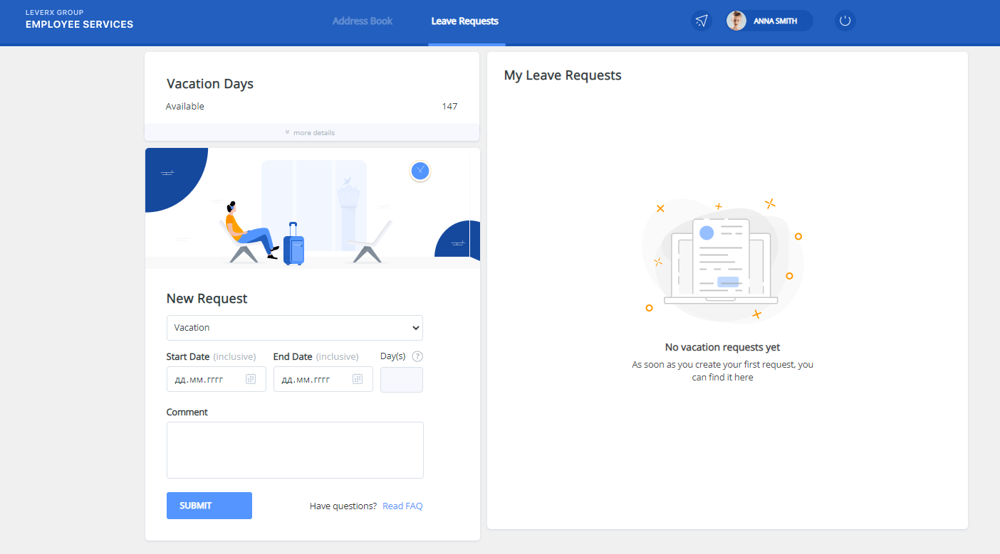
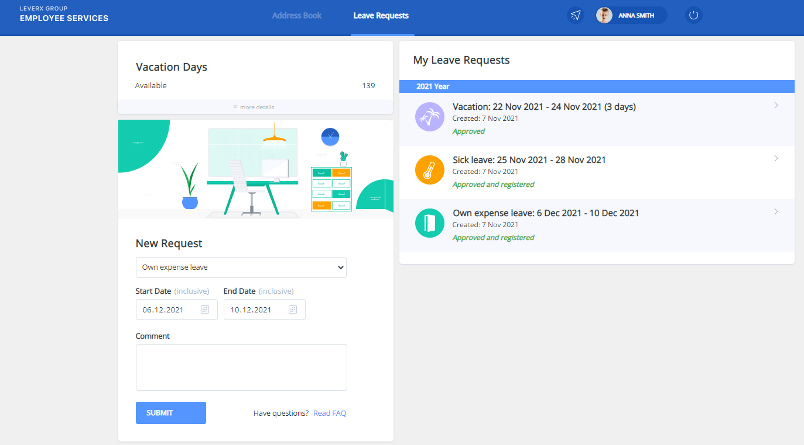

# Vacation
 This project I have made talking Frontend courses.
## Tools and Libraries
 In this project I use : 
    - HTML. 
    - SASS extension. 
    - React. 
    - Redux.  
    - ReduxToolkit.

## Usage
    There are three types of vacations. You must pick one of them and dates of your vacation.
    It must start at least in two weeks of your vacation request, otherwise you will
    get pop-up with warning instead. Also you are able to change type of vacation and dates of it.
    Clicking on your vacation you follow the link showing vacation details.
    On vacation details page you can change or delete your request.
    The project is still in progress...
    
## Screenshot

## Links
[Source code](https://github.com/mikitapapok/vacations/tree/vacation)
 
[deployed project](https://mikitapapok.github.io/vacations/)

